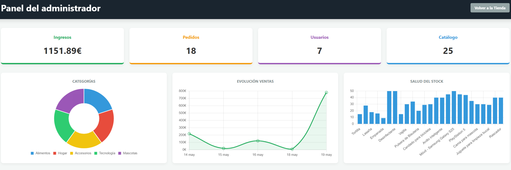

# 🛒 Supermercado Andrés Pérez de la Vega (Proyecto TFG)

Bienvenido a mi Trabajo de Fin de Grado. He creado una tienda online completa desde cero.

En este documento te voy a explicar paso a paso cómo arrancar este proyecto en tu propio ordenador de la forma más sencilla posible.

---

## 🛠️ 1. ¿Qué programas necesitas tener instalados?

Para que la tienda funcione en tu ordenador, necesitas cuatro programas básicos:
1. **Java (JDK 17 o superior):** Es el "motor" que hace funcionar la página.
2. **XAMPP:** Para correr los servicios de MySQL.
3. **MySQL y MySQL Workbench:** Es el "archivo" donde se guardarán los productos y usuarios.
4. **Un editor de código:** Te recomiendo **IntelliJ IDEA** o **Eclipse** para abrir el proyecto.

---

## 🚀 2. Pasos para encender la tienda

### Paso 1: Preparar la Base de Datos (El "almacén" vacío)
1. Abre el programa **MySQL Workbench**.
2. Arriba a la izquierda, pulsa en el icono que parece un pergamino con las letras **SQL** para abrir una pestaña en blanco.
3. Escribe exactamente esto:
   ```sql
   CREATE DATABASE ecommerce;
Pulsa el botón del rayo amarillo ⚡ para ejecutarlo.

Paso 2: Poner tu contraseña
Abre este proyecto con tu editor (IntelliJ IDEA o Eclipse).

En las carpetas de la izquierda, busca esta ruta y haz doble clic en el archivo:
👉 src ➔ main ➔ resources ➔ application.properties

Verás unas líneas de texto. Solo tienes que cambiar la que dice spring.datasource.password= y poner ahí la contraseña que le pusiste a tu MySQL al instalarlo.

Paso 3: ¡Arrancar el motor!
En tu editor, busca un archivo llamado EcommerceApplication.java.

Verás que al lado del código hay un botón verde de "Play" (▶️). Púlsalo.

Abajo empezarán a salir letras. Cuando el texto se detenga y veas que no se mueve más, significa que la tienda ya está encendida y el programa acaba de crear las tablas vacías en la base de datos.

Paso 4: Entrar a la tienda
Abre tu navegador de internet (Chrome, Firefox...).

En la barra de direcciones de arriba, escribe esto y pulsa Enter:
👉 http://localhost:8080

¡Felicidades! Ya estás dentro.

⚠️ ATENCIÓN: ¿Por qué la tienda está vacía? ⚠️
Como la base de datos es nueva, el catálogo no tiene ningún producto todavía. La tienda está limpia y lista para que la estrenes. Para rellenarla, vamos a crear al usuario "Jefe" en el siguiente paso.

👑 3. El panel secreto del Jefe (CÓMO CREAR EL ADMINISTRADOR Y PRODUCTOS)
Para que la tienda tenga productos, necesitas entrar como el dueño (Administrador) para añadirlos. Como ya hemos arrancado el programa en el Paso 3 y las tablas ya existen, ahora sí podemos crear al jefe:

Abre MySQL Workbench, abre la pestaña donde creaste la bd, copia y pega este bloque completo y dale al rayito amarillo ⚡:

```sql
USE ecommerce;
INSERT INTO usuario (username, email, password, rol) VALUES ('admin', 'admin@gmail.com', '1234', 'ADMIN');
```
Vuelve a la tienda en tu navegador web y haz clic en el botón de Login.

Inicia sesión con las credenciales que acabamos de meter:

Usuario: admin

Contraseña: 1234

Arriba en la cabecera te aparecerá un botón rojo que dice PANEL ADMIN.

⚙️ Gestión de Inventario (CRUD y Borrado Lógico)
El panel de administrador cuenta con un sistema CRUD completo (Crear, Leer, Actualizar y Borrar) para gestionar el catálogo:

Crear: Rellena el formulario "Añadir Nuevo Producto". Invéntate un par de artículos (puedes buscar fotos en internet y pegar su enlace) y dale a guardar.

Actualizar: Podrás editar el precio, stock, descripción o la imagen de cualquier producto en tiempo real.

Eliminar (Borrado Lógico): He implementado un sistema de Soft Delete. Si decides ocultar o "borrar" un artículo, no se elimina de la base de datos para no corromper las facturas antiguas de los clientes que lo compraron, simplemente desaparece de la vista de la tienda pública.

📊 Análisis y Gráficas del Administrador
Una vez dentro del Panel de Administrador, no solo podrás gestionar la tienda, sino que tendrás acceso a un Dashboard completo de métricas. He integrado gráficos dinámicos que muestran en tiempo real los ingresos, el porcentaje de ventas por categoría, la evolución diaria y la salud del stock.

(Así se ven las graficas dentro del panel de control) 👇


Nota: También podrás moderar a tu comunidad y eliminar comentarios negativos o inapropiados de parte de los usuarios que no tengan nada que ver con los productos.

🛍️ 4. ¿Qué puedes hacer como Cliente?
Si quieres probar la web como un comprador normal, puedes cerrar sesión del administrador y hacer lo siguiente:

Regístrate: Crea un usuario cliente inventado.

Haz la compra: Busca los productos que creó el administrador, fíltralos por categoría, añádelos al carrito y haz clic en "Confirmar y Pagar".

Deja tu opinión: Entra en cualquier artículo y déjale una valoración con estrellas y un comentario.

Revisa tu facturación: También puedes meterte en tu perfil como usuario para tener la factura de tus compras, con lo que te has gastado y lo que has comprado. Así tendrás un registro detallado de lo que compras, cuánto compras, con su fecha y cantidad de dinero.

🌐 5. ¿Qué pasa si entra un Visitante? (Usuario no registrado)
He diseñado la tienda para que cualquier persona que entre a la web desde internet pueda usarla de forma interactiva desde el primer segundo, sin necesidad de obligarle a registrarse obligatoriamente para mirar. Esto es lo que experimentará un visitante:

Cotillear y Filtrar: Puede buscar productos, cambiar de categoría y usar los filtros de precio exactamente igual que un usuario registrado.

Añadir productos a la cesta: Si el visitante ve algo que le gusta y le da al botón "Añadir al carrito", ¡el sistema funciona! El contador del carrito de arriba aumentará.

La "Magia" de la Cesta Guardada: Gracias a la memoria interna del navegador (localStorage), el visitante puede cerrar la pestaña, apagar el ordenador o irse a comer; cuando vuelva al día siguiente, sus productos seguirán guardados en la cesta esperándole.

¿Qué pasa si intenta pagar? Aquí es donde el sistema protege la tienda. Si el visitante va a "Tu Cesta" y pulsa el botón Confirmar y Pagar, el sistema detectará que no sabemos quién es. Saltará una ventana emergente muy elegante de SweetAlert2 avisándole de que debe identificarse e inmediatamente le redirigirá a la pantalla de Login.